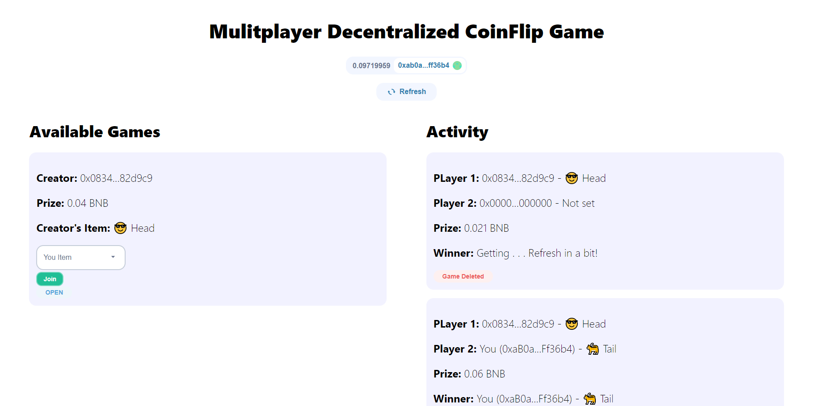

## My Project

## Coin Flip

Welcome to the Coin Flip application! This decentralized application (dApp) allows users to participate in a coin-flipping game where the winner is determined using verifiable randomness.

Please leave a ⭐ if you like it.

## Features

- Users can flip a coin with a chance to win rewards.
- Winner determination using Chainlink VRF ensures randomness and fairness.
- User authentication via Moralis for a secure experience.
- Intuitive UI components provided by Web3UIKit for an engaging user experience.

## Technologies Used

This project utilizes the following technologies:

- **[Hardhat](https://hardhat.org/)**: A development environment for compiling, deploying, and testing smart contracts.
- **[Chainlink](https://chain.link)**: Provides Verifiable Random Function (VRF) to determine the winner in a decentralized manner.
- **[React](https://reactjs.org/)**: A JavaScript library for building user interfaces.
- **[Moralis](https://moralis.io/)**: Used for user authentication and managing user sessions.
- **[Web3UIKit](https://github.com/web3ui/web3uikit)**: A library for UI components designed for web3 applications.

## 🌐 Socials:

## 💻 Tech Stack:

## Getting Started

### Prerequisites

Ensure you have the following installed on your machine:

- [Node.js](https://nodejs.org/) (version 14 or higher)
- [Yarn](https://yarnpkg.com/) (optional, but recommended)

### Installation

1. Clone the repository:

   - git clone https://github.com/yourusername/coin-flip.git
   - cd coin-flip
   - npm install
   - npm start
   - Open your browser and navigate to http://localhost:3000 to access the Coin Flip application.

